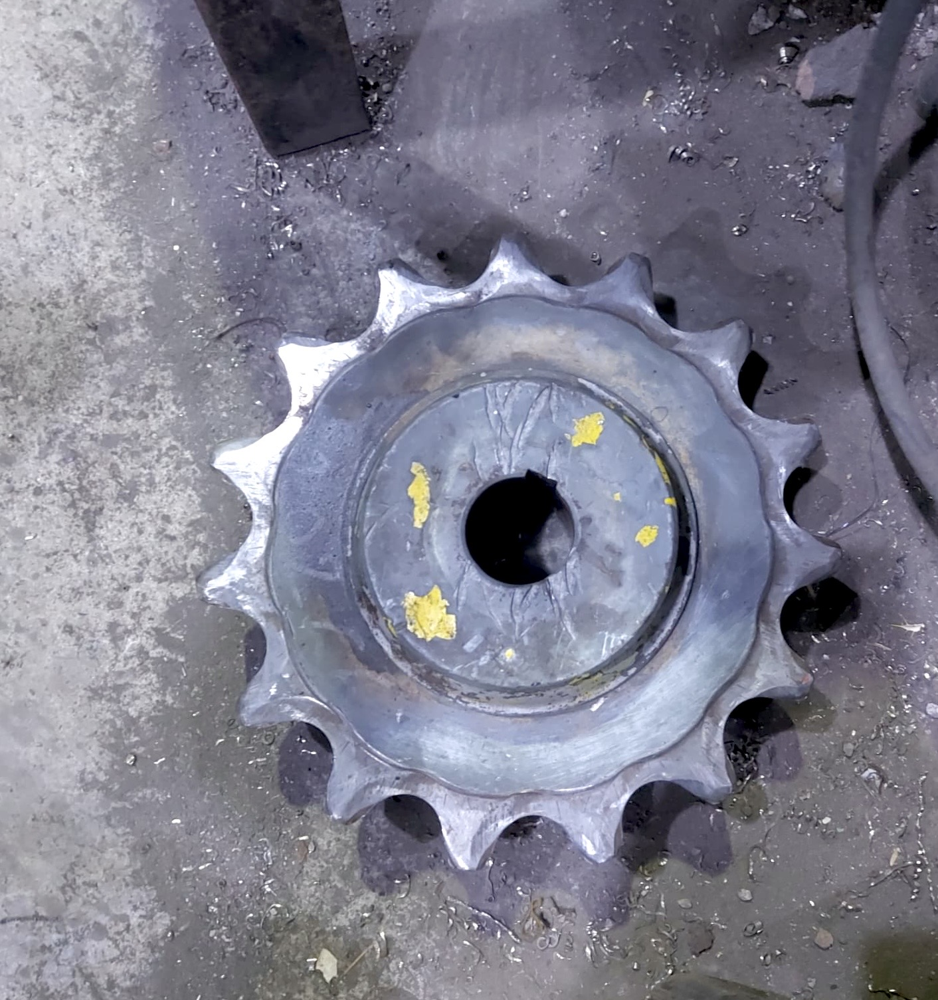

# sprocket-reverse-engineering

> **Project Type:** Component Reverse Engineering + Technical Proposal   
> **Tools:** SolidWorks, GearTrax  
> **Manufacturing Processes:** CNC Lathe Turning, Gear Hobbing (Tooth Cutting), Induction Hardening  


*(Figure 1: Final manufactured sprocket.)*

---

## Project Overview
A client supplied a worn drive sprocket requesting manufacturing and replacement. With no original engineering drawings/models or matching chain specifications provided

---

##  Reverse Engineering

### 1. Pitch Estimation & Chain Identification
* Due to severe tooth flank erosion direct pitch measurements were unreliable (initial rough estimates yielded $\approx 56\text{ mm}$ pitch).
* **Chain Size Verification:** After test-fitting multiple standard chains on the component, the sprocket was identified as an **ANSI #160 (2.0-inch / 50.8 mm pitch)** standard profile featuring a $20\text{ mm}$ pin diameter
* PS: The ISO standard correspondent to ANSI B29.1 would be ISO 606 I believe

### 2. Design Calculations
Using standard ANSI B29.1 formulas for a **15-tooth** sprocket, the PCD and root radii were calculated:

$$PCD = \frac{P}{\sin\left(\frac{180^\circ}{N}\right)} = \frac{50.8\text{ mm}}{\sin\left(\frac{180^\circ}{15}\right)} \approx 244.34\text{ mm}$$

### 3. 3D CAD Modeling (SolidWorks + GearTrax)

Using calculated parameters, **GearTrax** generated the exact ANSI tooth geometry, which I exported directly into **SolidWorks** to model the wheel


---


## 🛠️ DFM & Production Workflow

**Induction Hardening**: It is important to note that induction hardening was chosen due to the component's material (1.7225 alloy) as this specific alloy has enough carbon to be surface hardened without gas carburising. Induction hardening heats only the tooth surfaces to high temperatures before quenching, transforming the outer layer into martensite to resist roller chain abrasion. The inner bore, keyway, and hub core don't undergo the heat treatment meaning they maintain high toughness and ductility to absorb torsional dynamic loads and shock forces without cracking

```text
  [1] Stock Procurement ──► [2] CNC Lathe Turning ──► [3] Hobbing / Tooth Cutting
                                                                │
  [5] Client Delivery ◄── [4] Quality Control  ◄── [3.5] Induction Hardening
